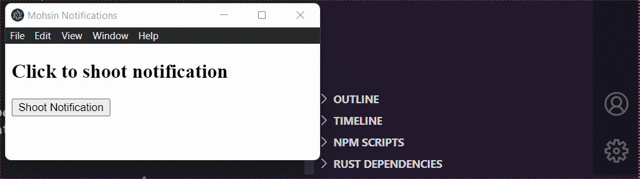

# Testing notifications in Electron.js
Creating an electron app that Just sends a notification, for example,    Experimental code 🔬

# Preview
    
## Install all dependencies
```
npm install
```

## Run on development 
```
npm run start
```

## Compare this app size vs Tauri app